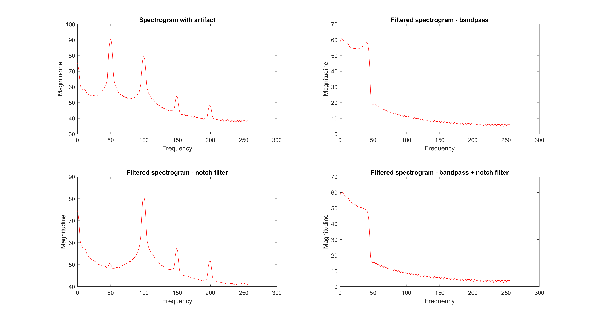
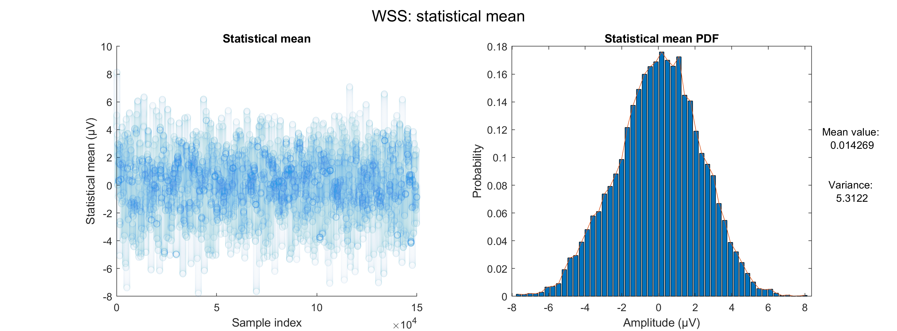

# Digital Signal Processing per EEG

L'obiettivo di questo progetto è studiare il digital signal processing applicato ai segnali EEG (elettroencefalografici), con particolare attenzione alle tecniche fondamentali per la loro analisi e trasformazione.

In primo luogo, viene affrontato il problema della filtrazione del segnale, con l'obiettivo di rimuovere l'interferenza di rete e altri artefatti indesiderati che possono compromettere la qualità del segnale.

Successivamente, si procede con lo studio delle proprietà statistiche del segnale EEG, valutandone la stazionarietà e l'ergodicità. Poiché il segnale EEG varia nel tempo e non è generalmente stazionario o ergodico, viene utilizzata la densità spettrale di potenza (PSD) come strumento analitico, calcolata tramite lo spettrogramma. Questo approccio consente di analizzare come l'energia del segnale si distribuisca nelle diverse frequenze nel dominio temporale.

Una volta caratterizzate le proprietà del segnale, si passa alla sua digitalizzazione, un passo cruciale nel DSP. Il segnale EEG viene inizialmente campionato, avendo una frequenza elevata (oversampled) di circa 5000 campioni al secondo. Infine, viene studiata la quantizzazione del segnale, che rappresenta la fase finale della digitalizzazione. Due metodi di quantizzazione vengono analizzati e confrontati: la quantizzazione uniforme, che utilizza una suddivisione equidistante del dominio dei valori del segnale, e una quantizzazione ottima, progettata per minimizzare l'errore di quantizzazione e ridurre il numero di bit necessari per la rappresentazione del segnale.

## Filtraggio dei segnali

Il filtraggio dei segnali elettroencefalografici (EEG) è una fase fondamentale nell'elaborazione del segnale per eliminare rumori indesiderati, migliorare la qualità del dato e permettere un'analisi più accurata. In questo contesto, il codice utilizza sia filtri FIR (Finite Impulse Response) che IIR (Infinite Impulse Response) per rispondere a esigenze specifiche:

- **Filtro passa-banda FIR**: questo filtro è progettato per isolare la gamma di frequenze di interesse (0,5–42 Hz), eliminando le componenti a frequenze troppo basse (come la deriva del segnale) e troppo alte (come il rumore ad alta frequenza). Tuttavia, i filtri FIR non sono sufficientemente selettivi per eliminare in modo efficace il rumore a una frequenza specifica, come l'interferenza a 50 Hz generata dalla rete elettrica.

- **Filtro Notch IIR**: per affrontare la necessità di rimuovere in modo mirato una frequenza specifica, viene introdotto un filtro notch basato su una struttura IIR. Questo tipo di filtro è particolarmente adatto per eliminare interferenze strette e persistenti, come quella a 50 Hz, con una maggiore efficienza rispetto ai filtri FIR.

Combinando questi due approcci, il codice garantisce un segnale pulito: il filtro passa-banda FIR si occupa dell'eliminazione generale del rumore, mentre il filtro Notch IIR gestisce in modo selettivo la rimozione del rumore a 50 Hz.

Il codice esegue il filtraggio seguendo una serie di passi:

1. **Filtro passa-banda FIR**:
   - Progettato utilizzando una finestra di Kaiser, che offre un buon compromesso tra selettività e attenuazione.
   - Il filtro è applicato utilizzando due metodi: `filter` e `filtfilt`.

2. **Filtro Notch IIR**:
   - Progettato con una frequenza centrale di 50 Hz per eliminare l'interferenza della rete elettrica.
   - Implementato utilizzando un'architettura diretta con coefficienti calcolati per garantire una stretta attenuazione intorno ai 50 Hz.

3. **Combinazione dei Filtri**:
   - Il segnale passa prima attraverso il filtro passa-banda FIR (per eliminare rumori generali), quindi attraverso il filtro notch IIR (per rimuovere l'interferenza specifica a 50 Hz).

Il ritardo di gruppo rappresenta il tempo necessario affinché una determinata frequenza del segnale passi attraverso un sistema di filtraggio. Esso differisce tra filtri FIR e IIR:

- **Filtro Kaiser con ritardo di gruppo costante**: i filtri FIR introducono un ritardo di gruppo costante su tutte le frequenze, pari a metà della lunghezza del filtro. Questo rende il ritardo prevedibile e uniforme, ma può essere problematico in applicazioni sensibili al tempo.

- **Filtro Notch con ritardo di gruppo non costante**: con i filtri IIR, il ritardo varia con la frequenza, essendo più pronunciato nelle vicinanze della frequenza centrale del notch (50 Hz in questo caso).

Per poter compensare il ritardo di gruppo nel filtro Kiaser, è possibile utilizzare `filtfilt`. La scelta tra `filter` e `filtfilt` dipende dalle esigenze dell'applicazione:

- **`filter`**:
  - Procede in una sola direzione (dal primo all'ultimo campione).
  - Introduce un ritardo di gruppo dovuto alla convoluzione causata dal filtro. Per un filtro FIR, questo ritardo corrisponde a metà della lunghezza del filtro.
  - È computazionalmente più semplice e adatto per applicazioni in tempo reale.

- **`filtfilt`**:
  - Applica il filtro due volte (in direzione temporale e anti-temporale).
  - Elimina il ritardo di gruppo, rendendo il segnale risultante allineato temporalmente al segnale originale.
  - Richiede il segnale completo, quindi non è adatto a elaborazioni in tempo reale.

## Stazionarietà ed ergodicità

Il presente paragrafo analizza le proprietà di stazionarietà in senso lato (Wide-Sense Stationarity, WSS) ed ergodicità di segnali EEG, considerando un dataset composto da realizzazioni di durata pari a 30 secondi. Il dataset è strutturato come una matrice di dimensioni $1076 \times 150000$, dove ciascuna riga rappresenta una realizzazione e ciascuna colonna un campione temporale.

### Stazionarietà in senso lato (WSS)
La stazionarietà in senso lato richiede che le statistiche di primo e secondo ordine, ovvero la media e l'autocorrelazione, siano invarianti rispetto al tempo.

La stazionarietà del primo ordine è stata analizzata calcolando la media dei campioni per ogni istante temporale su tutte le realizzazioni. I risultati evidenziano che la media è approssimativamente zero, confermato dalla distribuzione di probabilità (PDF) della media calcolata che è approssimabile tramite una gaussiana centrata nello zero.

L'analisi della funzione di autocorrelazione, invece, ha mostrato che essa varia significativamente tra campioni selezionati casualmente nel tempo. In altre parole, l'autocorrelazione non dipende esclusivamente dal lag temporale $\tau$, ma risulta anche funzione dell'istante temporale $t$. Questa non uniformità è attribuibile alla natura dinamica dei segnali EEG, influenzati da attività cerebrale transitoria e variabile, come onde alfa, beta, delta e theta.

### Ergodicità
Poiché i segnali EEG si sono dimostrati non stazionari di secondo ordine, ciò suggerisce che anche l'ergodicità non sia verificata. 

L'ergodicità di prim'ordine implica che le medie temporali calcolate su una singola realizzazione siano equivalenti alle medie statistiche calcolate su più realizzazioni. Confrontando la media temporale calcolata su una singola realizzazione con la media statistica complessiva, si osserva una forte concordanza.

Per quanto concerne il secondo ordine, la funzione di autocorrelazione temporale calcolata su una singola realizzazione è risultata significativamente diversa dall'autocorrelazione statistica globale. Questo comportamento è coerente con la non stazionarietà dei segnali EEG. In particolare, la non ergodicità dell'autocorrelazione è attribuibile alla variabilità intrinseca dei segnali EEG; durante eventi epilettici, ad esempio, si osservano pattern di scariche neurali che introducono specifiche caratteristiche di autocorrelazione, differenti da quelle riscontrabili in stati cerebrali normali. Di seguito viene riportato il differente andamento dell'autocorrelazione nel caso di segnali EEG epilettici e non epilettici:

## Densità spettrale di potenza

Come evidenziato, su intervalli temporali prolungati (ad esempio, 30 secondi), il segnale EEG non può essere considerato né stazionario né ergodico. Questa caratteristica intrinseca influenza significativamente l'analisi della densità spettrale di potenza, rendendo necessario esaminare il segnale su finestre temporali sufficientemente ridotte per cogliere eventuali anomalie, come quelle tipiche dell'epilessia. In questo contesto, l'utilizzo dello spettrogramma rappresenta una soluzione ideale, consentendo di visualizzare la distribuzione temporale e frequenziale della potenza e di monitorare le variazioni dinamiche nel contenuto spettrale del segnale.

L'analisi della densità spettrale di potenza è uno strumento fondamentale per caratterizzare il contenuto frequenziale di un segnale. Nei segnali non stazionari, come quelli EEG, la scelta del tempo di stazionarietà $T_{\text{staz}}$ è cruciale per bilanciare risoluzione temporale e frequenziale.

Per un segnale non stazionario, si assume che il segnale possa essere considerato stazionario a tratti (approssimativamente stazionario all'interno di finestre temporali). La densità spettrale di potenza è calcolata all'interno di ciascuna finestra tramite la trasformata discreta di Fourier (DFT).

La PSD è definita come:

$$
P_x(f) = \lim_{T \to \infty} \frac{1}{T} \left| X(f) \right|^2
$$

dove $X(f)$ è la trasformata di Fourier del segnale $x(t)$ in una finestra temporale di durata $T$.

Nel caso di segnali EEG, non stazionari per definizione, si utilizza la spettrogramma, che suddivide il segnale in finestre di durata $T_{\text{staz}}$. Per ogni finestra, si calcola la trasformata di Fourier e la PSD.

La scelta di $T_{\text{staz}}$ rappresenta un compromesso tra:
1. **Risoluzione temporale**: una finestra temporale più breve permette di rilevare variazioni rapide nel tempo, migliorando la precisione temporale.
2. **Risoluzione frequenziale**: una finestra temporale più lunga consente una maggiore precisione nella frequenza, poiché la risoluzione frequenziale è inversamente proporzionale alla lunghezza della finestra:

$$
\Delta f = \frac{1}{T_{\text{staz}}}
$$

Pertanto:
- Finestre brevi ($T_{\text{staz}}$ piccolo): buona risoluzione temporale, ma limitata risoluzione frequenziale.
- Finestre lunghe ($T_{\text{staz}}$ grande): alta risoluzione frequenziale, ma scarsa risoluzione temporale.

Un compromesso adeguato è necessario per catturare sia l'evoluzione temporale del segnale che il suo contenuto frequenziale.

Nel contesto dei segnali EEG analizzati, $T_{\text{staz}} = 1$ secondo si è rivelato un compromesso ottimale:
- Finestre di 0.5 secondi risultano troppo brevi, con una risoluzione frequenziale insufficiente per distinguere bande EEG (ad esempio alfa, beta, delta).
- Finestre di 5 o 10 secondi forniscono una risoluzione frequenziale elevata, ma non riescono a catturare variazioni rapide come quelle che si verificano durante eventi epilettici o transitori.
- Con $T_{\text{staz}} = 1$ secondo, si ottiene un bilanciamento precisione e risoluzione.

## Campionamento
Nel contesto dell'acquisizione dei segnali EEG, i dati originali, campionati a **5000 campioni al secondo**, sono stati successivamente ridotti a **500 campioni al secondo**. Tale riduzione è valida, in accordo con il teorema di Nyquist-Shannon, che stabilisce che la frequenza di campionamento deve essere almeno il doppio della frequenza massima del segnale per evitarne l'aliasing. Se la frequenza massima del segnale EEG non supera i **250 Hz**, la riduzione della frequenza di campionamento non comporta alcuna perdita di informazione.

$$
f_s \geq 2 f_{\text{max}}
$$

Le frequenze tipiche nell'EEG variano da 0,5-4 Hz (onde delta) a 30-100 Hz (onde gamma), con frequenze intermedie come 4-8 Hz (onde theta), 8-13 Hz (onde alfa) e 13-30 Hz (onde beta). Poiché la componente più alta di frequenza del segnale EEG solitamente non supera i 250 Hz, campionare a 500 Hz è sufficiente per catturare tutte le informazioni rilevanti, rispettando il principio di Nyquist.

## Quantizzazione
Nell'ambito dell'analisi del segnale EEG, dopo aver esaminato i grafici della Funzione di Densità di Probabilità (PDF) e della Funzione di Distribuzione Cumulativa (CDF), si osserva che la PDF del dataset in esame presenta una forma prossima alla distribuzione gaussiana, centrata intorno allo zero. Questo andamento riflette la natura prevalentemente simmetrica e a bassa ampiezza dei segnali EEG, ma è interessante notare che la distribuzione si estende fino a 1000 µV, includendo anche le oscillazioni più intense associate a fenomeni come l'epilessia. Tali caratteristiche del segnale devono essere prese in considerazione nel processo di quantizzazione, al fine di preservare l'integrità del dato e ridurre al contempo la quantità di bit necessari per rappresentarlo.

Il processo di quantizzazione è stato inizialmente eseguito in maniera uniforme, applicando una divisione regolare dell'intervallo di valori del segnale in un numero predefinito di livelli discreti.

Per ottimizzare l'uso della memoria e minimizzare il numero di bit necessari per la rappresentazione digitale del segnale, è stata quindi applicatala quantizzazione ottima non uniforme. Questa tecnica si basa sull'adozione di una suddivisione dei livelli di quantizzazione che varia in funzione della densità di probabilità del segnale stesso. In altre parole, i livelli di quantizzazione vengono concentrati nelle aree di maggiore probabilità, tipicamente quelle vicine allo zero, mentre nelle aree con distribuzione più sparsa (come i picchi dei segnali epilettici), si utilizzano livelli più distanziati. 

### Quantizzazione uniforme
In un sistema di quantizzazione uniforme, l'intervallo di valori del segnale continuo viene suddiviso in livelli discreti uniformemente distribuiti. Il numero totale di livelli disponibili in questo caso è determinato dalla quantità di bit utilizzati per la rappresentazione, che nel nostro caso è di 12 bit. Di questi, 1 bit è riservato per rappresentare la parte frazionaria del numero (cioè, per rappresentare le frazioni di un livello discreto), mentre i rimanenti 11 bit sono utilizzati per rappresentare i valori interi del segnale.

Una volta eseguita la quantizzazione uniforme a 12 bit, è fondamentale valutare le prestazioni del sistema attraverso alcuni parametri chiave, come il range dinamico e il rapporto segnale/rumore di quantizzazione (SQNR).

Il range dinamico è un indicatore della capacità del sistema di rappresentare l'ampiezza del segnale. Esso esprime il rapporto tra la lunghezza dell'intervallo di valori rappresentabili e la risoluzione del sistema, cioè il passo frazionato. Nel nostro caso, l'intervallo rappresentabile è determinato dalla variabilità dei valori tra il minimo e il massimo rappresentabili (`mfp_target` e `Mfp_target`), e la risoluzione è definita dal passo frazionato (`Nfp_target`). La formula per il calcolo del range dinamico in decibel è la seguente:

$$
DR_{\text{db}} = 20 \cdot \log_{10}\left(\frac{R}{Nfp_{\text{target}}}\right)
$$

dove $R = 2 \cdot |mfp_{\text{target}}|$ rappresenta la lunghezza dell'intervallo rappresentabile, mentre $Nfp_{\text{target}}$ è la risoluzione frazionaria.

Un altro parametro importante è il rapporto segnale/rumore di quantizzazione (SQNR). Questo indicatore misura l'efficacia con cui il sistema quantizza il segnale, confrontando la potenza del segnale quantizzato con la potenza dell'errore introdotto dalla quantizzazione. Il valore del SQNR è dato dalla formula:

$$
SQNR = 10 \cdot \log_{10}\left(\frac{P_{\text{segnale}}}{P_{\text{errore}}}\right)
$$

dove $P_{\text{segnale}}$ è la potenza del segnale quantizzato e $P_{\text{errore}}$ è la potenza dell'errore di quantizzazione. Un valore più alto di SQNR implica una minore distorsione nel segnale causata dall'errore di quantizzazione.
