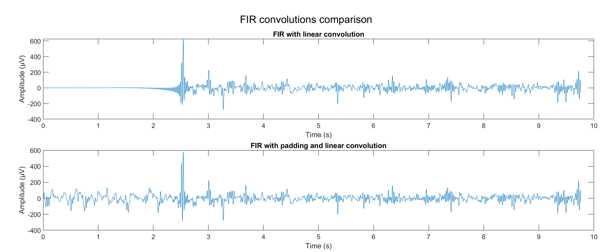
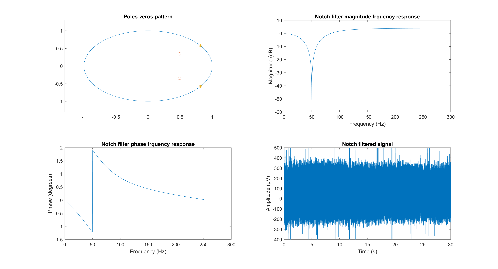
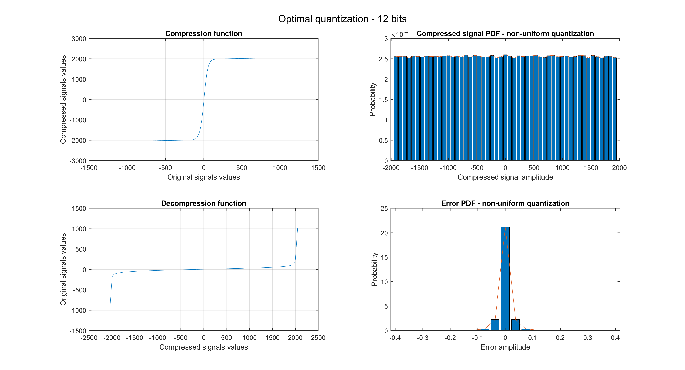

# Digital Signal Processing for EEG

The goal of this project is to study numerical processing applied to EEG (electroencephalographic) signals, with a focus on fundamental techniques for their analysis and transformation.

First, the problem of signal filtering is addressed, with the aim of removing network interference and other undesirable artifacts that may impair signal quality.

Next, the statistical properties of the EEG signal are studied, evaluating its stationarity and ergodicity. Since the EEG signal varies over time and is generally not stationary or ergodic, the spectrogram is used to analyze the power spectral density (PSD). This approach makes it possible to analyze how the signal energy is distributed across the different frequencies in the time domain.

Once the properties of the signal have been characterized, it is then digitized. The EEG signal is initially sampled, having a high (oversampled) frequency of about 5,000 samples per second. Finally, the quantization of the signal is studied, which is the final stage of digitization. Two quantization methods are analyzed and compared: uniform quantization, which uses an equidistant subdivision of the domain of signal values, and optimal quantization, which is designed to minimize the quantization error or reduce the number of bits required to represent the signal.

## Signal filtering

Filtering of electroencephalographic signals is a key step in signal processing to eliminate unwanted noise, improve data quality, and enable more accurate analysis. In this context, the code uses both FIR (Finite Impulse Response) and IIR (Infinite Impulse Response) filters to address specific needs:

- **FIR bandpass filter**: This filter is designed to isolate the frequency range of interest (0.5-42 Hz), eliminating components at frequencies that are too low and too high (such as high-frequency noise). However, FIR filters are not selective enough to effectively eliminate noise at a specific frequency, such as 50 Hz interference generated by the power grid.

- **IIR Notch Filter**: To address the need for targeted removal of a specific frequency, a notch filter based on an IIR structure is introduced. This type of filter is particularly suitable for removing narrow and persistent interference, such as that at 50 Hz, with higher efficiency than FIR filters.

By combining these two approaches, the code ensures a clean signal: the FIR bandpass filter handles general noise removal, while the IIR notch filter selectively handles 50 Hz attenuation.

### FIR filter through Kaiser
The FIR filter designed through Kaiser's window was used to preserve only EEG signal frequencies between 0.5 and 45 Hz. This range is critical for electroencephalographic analysis, as it allows preservation of useful signal components while eliminating undesirable ones, such as high-frequency noise and mains interference.
The behavior of the FIR filter is analyzed in both time and frequency domains. Below, the result of filtering applied to the raw data is reported:

Filtering can be implemented using two main approaches:
1.	Linear convolution: this approach generates an aliasing-free result, but introduces a group delay equal to:

$$
\tau_g = \frac{N-1}{2}
$$

where N is the length of the filter.

2.	Circular convolution: this method is computationally efficient but can introduce circular aliasing if appropriate precautions are not applied. By using appropriate padding, circular convolution becomes equivalent to linear convolution.

The following figure shows the results obtained through the two filtering approaches, highlighting the difference between linear and circular convolution from the point of view of the initial delay of the filtered signal:

Circular convolution can be implemented in MATLAB through two different methodologies:
1.	Adding a padding equal in length to the filter: extending the original signal by adding to its beginning a sequence of its end samples equal in length to the length of the filter.

$$
x_{\text{padded}} = [x[M-L+1 : L], \, x]
$$

with M equal to the length of the signal, and L equal to the length of the filter. Next, linear convolution is performed on the extended signal through the created filter, and the first L and last L-1 samples are removed from it.
2.	Using the discrete Fourier transform (DFT): convolution is performed in the frequency domain, taking advantage of the properties of the discrete Fourier transform:

$$
y[n] = \text{IDFT}\big[\text{DFT}[x] \cdot \text{DFT}[h]\big]
$$

### Notch-type IIR filter
For the removal of electrical interference concentrated in a very narrow frequency range, such as 50 Hz due to network interference, a Notch-type IIR filter was used. This type of filter is ideal for selectively attenuating a very narrow frequency range due to its high transition slope.
The Notch filter was designed by placing:
-	Zeros on the unit circle, at frequencies corresponding to ±50 Hz, to completely cancel the signal in this band.
-	Poles at a distance from the center of the unit circle equal to r=0.8, to ensure filter stability and control the width of the attenuation band.

Despite its high selectivity, the IIR filter has a significant defect: the non-constant group delay. In particular, near 50 Hz, the group delay reaches high values due to the presence of the poles and zeros near the notch frequency. Despite having a non-constant group delay, IIR has a significant advantage over the FIR filter: the overall delay is much smaller.

## Stationarity and ergodicity

This section analyzes the properties of Wide-Sense Stationarity (WSS) and ergodicity of EEG signals, considering a dataset consisting of realizations of 30-second duration. The dataset is structured as a matrix of size $1076 \times 150000$, where each row represents a realization and each column a time sample.

### Stationarity in the broad sense (WSS).
Stationarity in the broad sense requires first- and second-order statistics, i.e., mean and autocorrelation, to be invariant with respect to time.

First-order stationarity was analyzed by averaging the samples for each time instant over all realizations. The results show that the mean is approximately zero, confirmed by the probability distribution (PDF) of the calculated mean, which can be approximated by a zero-centered Gaussian.

Analysis of the autocorrelation function, however, showed that it varies significantly between randomly selected samples over time. In other words, the autocorrelation does not depend solely on temporal lag $\tau$, but is also found to be a function of temporal instant $t$. This nonuniformity is attributable to the dynamic nature of EEG signals, which are influenced by transient and variable brain activity, such as alpha, beta, delta and theta waves.

### Ergodicity
Since EEG signals have been shown to be nonstationary of second order, this suggests that ergodicity is also not verified. 

First-order ergodicity implies that time averages computed over a single realization are equivalent to statistical averages computed over multiple realizations. Comparing the time average computed on a single realization with the overall statistical average, a strong agreement is observed.

Regarding the second order, the temporal autocorrelation function calculated on a single realization was moderately different from the global statistical autocorrelation. This behavior is consistent with the nonstationarity of EEG signals. Specifically, the nonergodicity of autocorrelation is attributable to the inherent variability of EEG signals; during epileptic events, for example, patterns of neural discharges are observed that introduce specific autocorrelation features that differ from those found in normal brain states. The different autocorrelation patterns in the case of epileptic and nonepileptic EEG signals are shown below:

## Power spectral density.

As pointed out, over prolonged time intervals (e.g., 30 seconds), the EEG signal can be considered neither stationary nor ergodic. This inherent characteristic significantly affects the power spectral density analysis, making it necessary to examine the signal over sufficiently small time windows to catch any abnormalities, such as those typical of epilepsy. In this context, the use of the spectrogram is an ideal solution, allowing the temporal and frequency distribution of power to be visualized and dynamic changes in the spectral content of the signal to be monitored.

Power spectral density analysis is a fundamental tool for characterizing the frequency content of a signal. In nonstationary signals, such as EEG signals, the choice of stationary time $T_{\text{staz}}$ is crucial to balance temporal and frequency resolution.

For a nonstationary signal, it is assumed that the signal can be considered stationary at intervals (approximately stationary within time windows). The power spectral density is calculated within each window using the discrete Fourier transform (DFT).

The PSD is defined as:

$$
P_x(f) = \lim_{T \to \infty} \frac{1}{T} \left| X(f) \right|^2
$$

where $X(f)$ is the Fourier transform of the signal $x(t)$ in a time window of duration $T$.

The choice of $T_{text{staz}}$ represents a compromise between:
1. **Temporal resolution**: a shorter time window allows rapid changes in time to be detected, improving temporal accuracy.
2. **Frequency resolution**: a longer time window allows for greater frequency accuracy, since frequency resolution is inversely proportional to window length:

$$
\Delta f = \frac{1}{T_{\text{staz}}}
$$

Therefore:
- Short windows ($T_{text{staz}}$ small): good temporal resolution, but limited frequency resolution.
- Long windows ($T_{\text{staz}}$ large): high frequency resolution, but poor temporal resolution.

A suitable compromise is needed to capture both the temporal evolution of the signal and its frequency content.

In the context of the EEG signals analyzed, $T_{\text{staz}} = 1$ second proved to be an optimal compromise:
- 0.5-second windows are too short, with insufficient frequency resolution to distinguish EEG bands (e.g., alpha, beta, delta).
- Windows of 5 or 10 seconds provide high frequency resolution, but fail to capture rapid changes such as those occurring during epileptic or transient events.
- With $T_{\text{staz}} = 1$ second, a balance of precision and resolution is achieved.

## Sampling
In the context of EEG signal acquisition, the original data, sampled at **5000 samples per second**, was subsequently reduced to **500 samples per second**. This reduction is valid, in accordance with the Nyquist-Shannon theorem, which states that the sampling rate must be at least twice the maximum frequency of the signal to avoid aliasing. If the maximum frequency of the EEG signal does not exceed **250 Hz**, reducing the sampling frequency does not result in any loss of information.

$$
f_s \geq 2 f_{\text{max}}
$$

Typical frequencies in EEG range from 0.5-4 Hz (delta waves) to 30-100 Hz (gamma waves), with intermediate frequencies such as 4-8 Hz (theta waves), 8-13 Hz (alpha waves) and 13-30 Hz (beta waves). Since the highest frequency component of the EEG signal usually does not exceed 250 Hz, sampling at 500 Hz is sufficient to capture all relevant information, respecting the Nyquist principle.

## Quantization
As part of the analysis of the EEG signal, after examining the graphs of the Probability Density Function (PDF) and Cumulative Distribution Function (CDF), it is observed that the PDF of the dataset under consideration exhibits a shape close to Gaussian distribution, centered around zero. This pattern reflects the predominantly symmetric, low-amplitude nature of EEG signals, but interestingly, the distribution extends up to 1000 µV, including even the most intense oscillations associated with phenomena such as epilepsy. Such signal characteristics must be taken into account in the quantization process in order to preserve the integrity of the data while reducing the amount of bits needed to represent it.

The quantization process was initially performed uniformly, applying a smooth division of the signal value range into a predefined number of discrete levels.

To optimize memory usage and minimize the number of bits required for the digital representation of the signal, nonuniform optimal quantization was then applied. This technique is based on adopting a subdivision of quantization levels that varies according to the probability density of the signal itself. In other words, quantization levels are concentrated in areas of higher probability, typically those near zero, while in areas with more sparse distribution (such as the peaks of epileptic signals), more spaced-out levels are used. 

### Uniform quantization
In a uniform quantization system, the range of continuous signal values is divided into uniformly distributed discrete levels. The total number of levels available in this case is determined by the amount of bits used for representation, which in our case is 12 bits. Of these, 1 bit is reserved to represent the fractional part of the number (i.e., to represent the fractions of a discrete level), while the remaining 11 bits are used to represent the integer values of the signal.

Once uniform 12-bit quantization has been performed, it is critical to evaluate the performance of the system through some key parameters, such as dynamic range and quantization signal-to-noise ratio (SQNR).

Dynamic range is an indicator of the system's ability to represent signal amplitude. It expresses the ratio between the length of the representable range and the resolution of the system, that is, the fractional pitch. In our case, the representable range is determined by the variability of the values between the minimum and maximum representable (`mfp_target` and `Mfp_target`), and the resolution is defined by the fractional step (`Nfp_target`). The formula for calculating the dynamic range in decibels is as follows:

$$
DR_{\text{db}} = 20 \cdot \log_{10}\left(\frac{R}{Nfp_{\text{target}}}\right) \approx 6 \cdot B
$$

where $R = 2 \cdot |Mfp_{\text{target}}|$ represents the length of the representable interval, and B is the  number of available bits.

| Dynamic range (dB) |
|     :---:      |
| 72.25 |

Another important parameter is the quantization signal-to-noise ratio (SQNR). This indicator measures how effectively the system quantizes the signal by comparing the power of the quantized signal with the power of the error introduced by the quantization. The value of the SQNR is given by the formula:

$$
SQNR = 10 \cdot \log_{10}\left(\frac{P_{\text{segnale}}}{P_{\text{errore}}}\right)
$$

where $P_{\text{signal}}$ is the average power of the quantized signal values, and $P_{\text{error}}$ is the average power of the quantization errors. A higher value of SQNR implies less distortion in the signal caused by the quantization error. SQNR can reach the value of dynamic range in the case where the probability density of the signal to be quantized can be approximated as uniform. In the case of this signal this is not valid, and thus we have this value:
| | Uniform quantization |
| --- |     :---:      |
| SQNR (dB) | 52.91 |

### Non-uniform quantization: hybrid approach.

In the quantization phase of EEG signals, a mixed strategy combining two distinct approaches was chosen: uniform and non-uniform (optimal) quantization. This decision was motivated by the analysis of the distribution of EEG signals, which has an extremely low probability for values above 200 µV, resulting in a high risk of errors if optimal quantization, designed on the basis of the cumulative distribution function (CDF) of these signals, were to be applied. Optimal quantization, in fact, tends to focus more on the most frequent values and, in the presence of rare but high peaks, could result in significant error during data compression.

To overcome this issue, it was decided to implement a hybrid quantization that exploits uniform quantization for signals with amplitudes above 224 µV (the so-called “unlikely” data), and non-uniform optimal quantization for those with amplitudes below this threshold (the “likely” data). In this way, a maximum error of about 8 µV can be maintained for higher signals, while limiting the error for more common signals and reducing the overall complexity of the system.

In detail, it was decided to use a total length of 12 bits for quantization, as in the previous uniform approach. A portion of these bits is allocated to the quantization of “unlikely” values, ensuring that the compression of these signals does not exceed the predetermined error limit. The remaining bits are instead used for “likely” values, for which the CDF is calculated. It is scaled and translated appropriately, leaving sufficient space in the Look-Up Table (LUT) for the representation of the “unlikely” data.

Since the original data have precision with a large number of decimal places, preliminary quantization was necessary to avoid the excessive length of the Look-Up Table. In detail, the quantization was limited to a precision of 5 fractional bits in order to optimize efficiency without significantly compromising the data representation.

As can be guessed, this approach yields constant accuracy for values above the 224 µV threshold, while for lower values the accuracy becomes variable, depending directly on the probability density.

  

Comparing the SQNR values obtained for values above and below, in modulus, the 224 µV threshold, we have:

| | Optimal quantization |
| --- |     :---:      |
| SQNR for uniform (dB) | 62.89 |
| SQNR for non-uniform (dB) | 40.54 |